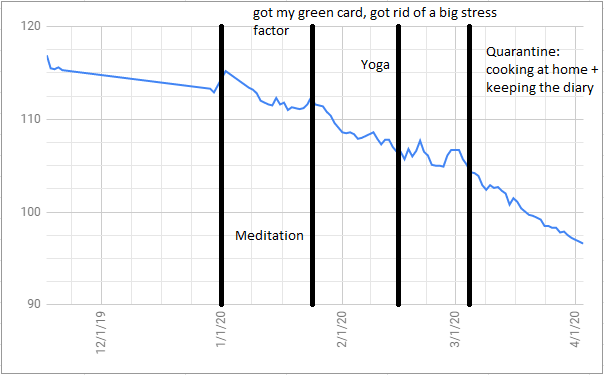

# My Weight Loss Journey, So Far

In this post I’ll describe my most recent experience of losing weight. In short, by the end of November 2019 my weight was 117 kg (258 lbs), now it’s 97 kg (213 lbs), which pushes me back into merely the “overweight” range of the [body mass index](https://en.wikipedia.org/wiki/Body_mass_index). Last time I had similar weight was around the summer of 2016. Moreover, unlike many of the previous weight loss attempts, I feel that my current approach is much more sustainable, since it organically eliminates any trace of suffering, physical or mental, and I’m genuinely enjoying the process. My journey is far from being over, since I still have lots of unnecessary weight, but this time I have at least a spark of optimism about the further progress. I hope my story will be useful for someone, particularly since these days most of the folks are stuck at home, *with an obvious caveat that weight loss is highly individual and what works for me might not work for you (unfortunately, it might not even work for me in the future). Also, if you have any kind of noticeable health issue, consult with your physician before making a decision to lose weight.*

First of all, I think it’s extremely important to figure out your motivation. It needs to be strong enough to push you to transform your life. For me it’s been pretty easy: I’ve been feeling like crap, both physically (snoring, low energy level that needs constant fueling with caffeine, etc) and mentally (I have always despised my body, even when my weight was more or less normal, but having so much body fat makes looking in a mirror a truly miserable experience). My current effort allowed me to address both of these issues to a significant degree, more or this later.

My weight has always been a struggle, especially since I came to the US with its admittedly pretty terrible food culture (which I readily embraced). I’ve tried so many different things to manage my weight, and none of them really worked: over the course of 8 years living in the US, I’ve put on 37 kilos (82 lbs). I’ve tried (long-distance) running, it’s been somewhat rewarding but after every run I was starving and binging on food, strength training / weight lifting with a personal trainer -- kind of the same problem. I’ve tried some diets: there was always suffering involved and some limited results vanished after inevitable relapses. I’ve tried the approach outlined in the (nicely written) [post](http://matt.might.net/articles/least-resistance-weight-loss/) by [Matt Might](http://matt.might.net/), “Least resistance weight loss”, but now thinking about it, I understand that I should not have even bothered with trying it, since the approach amounts to punishing yourself for eating food that you love until you stop loving it. Basically, nothing worked, and kilos have just been piling up. Over the course of these years, many of my friends lost significant amounts of weight, and their stories were very inspiring and motivating, but none of the approaches really stuck with me, and I kept wondering what’s the missing piece in all these stories. Putting it differently, I needed an approach to weight loss that does not involve vigorous exercise, willpower, external motivation or suffering of any kind, none of these would be sustainable for my impulsive and compulsive personality.

**My biggest breakthrough was to realize and fully accept that I am addicted to food**. It sounds like a triviality, but bear with me, this realization has many important consequences! Initially, I was working with my addiction to coffee. I tried quitting drinking it many times, and very quickly realized that the physical aspect of the addiction is almost non-existent: there is mild sleepiness that vanishes after a couple of days, but the real trouble is the psychological side of the addiction: I kept getting returning to drinking coffee again and again and again. This naturally surprised me, I never imagined psychological addiction would be a real thing and started studying this question systematically by reading blogs and diaries and watching YouTube channels of recovering alcoholics and drug addicts (perhaps my favorite is [this YouTube channel](https://www.youtube.com/channel/UCacn-Cy4KtIm-dl0iuLHAUA), especially see [this video](https://www.youtube.com/watch?v=RQa8BCe6vik) about relapsing after six years of being sober). And the more I consumed such content, the more I realized that my addiction to coffee has exactly the same mechanics as alcoholism or addiction to some drugs (of course, anything that messes up your dopamine such as meth must be much scarier to be addicted to, but some more moderate drugs seems to have exactly the same pattern: relatively easy-to-overcome physical addiction, but extremely hard to deal with psychological component). Around that time, I realized that I’m addicted to food in exactly the same way. On one hand, equating myself with alcoholics and drug addicts was very humbling and somewhat scary, but, on the other hand, I was relieved and happy that I could put some label on my struggle, since the ways to deal with addictions are fairly well-understood. Now it became clear that any approach to cure my food addiction should be mind-centric, and only then dieting or exercise can be added on top. Indeed, what can be simpler than consuming less calories than spending, yet why is it so tricky to implement?

I started to look inwards and realized that my relationship with food is truly an abusive one. My mind often confuses hunger with other feelings (thirst, boredom, loneliness, stress etc) and immediately panics, my body immediately stiffens in return, the heart rate goes up, which only amplifies the panic, and I’m getting a massive urge to stuff myself with whatever food I have in my proximity, and of course afterwards lots of guilt and stress get added to it as if it was not enough already. It’s amazing that it took me twenty nine years to reflect enough to see this simple pattern. So, what can I do to counteract this short circuiting?

What I needed was a holistic approach that:
  -  Reduces the stress (my life can stay the same, but it’s not necessary to get stressed and suffer from it),
  -  Teaches me to listen to my body, not to panic and shut down from light hunger,
  -  Creates a gap between stimulus and response to break the “short circuiting”.
Putting it differently, I need to deal with cravings, this is the primary goal, and losing weight is secondary. Below I describe what helped me to achieve this and more. This is exactly the missing piece in all of the inspiring stories of my friends and on the Internet: what they describe is merely a facade of a much deeper transformation that inevitably happened to them.

The main tool that helped was mindfulness meditation. I've been doing it systematically since the very beginning of this year using [Headspace](https://www.headspace.com/): I started with just five minutes a day, and now ramped it up to 30--45 minutes depending on my mood. Meditation addresses exactly the set of issues I outlined in the previous paragraph: it allows you to decouple yourself from your mind, inspect and study it, and experience thoughts and feelings in a non-reflectory and non-judgemental way. Besides Headspace, I highly recommend the book [“The Mind Illuminated”](https://www.amazon.com/Mind-Illuminated-Meditation-Integrating-Mindfulness/dp/1501156985), very often I’m simply doing an unguided meditation using the technique from it.

Around mid-February, I added power vinyasa yoga to meditation. In a way, yoga is dual to meditation: while meditation allows you to inspect your mind, yoga allows you to inspect your body, which really helps to see which foods are good for you, and which are not. I’ve been lucky to find a great studio [Shakti Vinyasa](http://shaktivinyasa.com/), which has now switched to online classes (I’m doing roughly 5--6 classes per week). Besides yoga classes, I have read an awesome book about yoga [Journey into Power](https://www.amazon.com/Journey-Into-Power-Sculpt-Transform-ebook/dp/B005C7CWJ8), which I highly recommend even if you couldn't care less about folding your body into a pretzel. For instance, the chapter about food is a great summary of what I’m talking about in this post (“food is often a drug and a torture weapon”, “mindful eating” etc), except that it’s much more eloquent and inspiring. One further benefit of yoga is that it teaches you to love your body, no matter what shape and size it is, by showing you what it’s capable of. It addressed my psychological issue that was killing me before (literally, through food binging). Finally, yoga is pretty vigorous exercise yet you don’t suffer from it. In fact, it has the opposite effect, every class makes me euphoric (both in the process and after it’s over).

Together, meditation and yoga really transformed my food habits without any effort. There is a meme “your body is a temple”, and that’s exactly where I’ve arrived at through these practices. Sometimes I just look back and see how I tortured my body with food and other bad habits and do not understand how it took me so long to see it and start working to get rid of it. Besides this transformation, these practices really encourage you to live life in a minimalist way. In the context of food, it means eating simple foods from few components, employing moderation to avoid torturing yourself and not being afraid to under-eat as long as you listen to your body (not mind, crucially). On that note, sometimes (once every few weeks or so) I’m doing 36-hour fasts, precisely to learn not to panic from the feeling of hunger.

Let me briefly mention some “low-level” tricks that helped me big time:

-   Get a food scale, weigh everything you are eating and keep a detailed diary of your meals while counting calories. It is really educational and soon you will learn to swap out ingredients that are “empty calories” with tastier and healthier alternatives. Especially, during the COVID-19 quarantine, I find tweaking my food to be an extremely fun hobby that makes me happy and really helps to stay grounded with all the chaos around.
-   Cook without any oil, not only is it possible, the end result is often actually tastier. For meat and eggs, use [a sous vide circulator](https://en.wikipedia.org/wiki/Sous-vide), for rice and other grains, use a rice cooker. I never imagined that skinless chicken breast cooked without oil is not a torture weapon, but can actually be super tasty. Oil (sesame or olive) can still be used as a condiment, but then you can add a really small amount of it to have an intended effect.    
-   Fruits are awesome. I was never a fruit person, especially since most of the nutritional advice keeps telling how much sugar fruits have. It’s true, fruits do have some sugar, but many fruits have lots of fiber along with it, which allows the sugar to be released into your bloodstream [very slowly](https://www.health.harvard.edu/diseases-and-conditions/glycemic-index-and-glycemic-load-for-100-foods), which makes it way less of a problem. Besides, most of the fruits are surprisingly low on calories and at the same time super tasty.
-   Get a support group. I’m constantly chatting with a friend, who has also been losing weight and building muscle. It really helps to exchange advice and simply support each other. You can take this piece of advice further and go to one of the many analogs of [Alcoholics Anonymous](https://www.aa.org/) groups for food addicts. I personally have not yet tried it, but I will at some point.
-   Record your weight every day, but don't get stressed by its inevitable fluctuations. Too many times before, I gave up my weight loss efforts precisely because of these pesky fluctuations. You should just believe that you are on a good track and eventually things will be OK.

Here is my typical menu these days:

 - Breakfast: poached eggs or fruits
 - Lunch: rice/pasta/buckwheat/lentils with chicken breast or salmon
 - Between lunch and dinner (полдник): a few crackers with jam or honey
 - Dinner: a salad that includes nuts, avocado and cheese
 - After dinner: more fruits

I'm trying to stay under 1400 calories, which together with yoga creates a healthy calorie deficit. Again, let me stress that my set-up is just an example of what you can do, keep tweaking your routine until your body is happy with it. This led to the following dynamic of the weight over time:

All in all, the quality of my life improved drastically (in particular, snoring disappeared, which had an immediate consequence on the quality of my sleep and the energy level). I feel awesome about my body (even though I still have quite a bit of unnecessary weight, but it really does not bother me). I’m really enjoying my new lifestyle (though I do want to add weight lifting and running back, but a bit later, when my routine stabilizes). I feel like I’m on a good track and really finding my own way rather than following someone else's. I really hope to update you with more good news and write a follow-up post. Am I confident that I got rid of the food addiction? Quite the opposite, as with alcohol or drug abuse, the addiction is and will always be there, the best I can do is to keep it at bay and constantly remind myself about it.

Let me reiterate that the main breakthrough for me was to build weight loss around taming my sick mind rather than blindly following some pre-built regimen. I'm convinced that if you use the mindful approach then any reasonable diet and exercise that do not contradict common sense and basic science should work well. If you are on a similar path and need any words of support, please feel free to reach out to me: I got lots of inspiration and support from many friends and family members and hope to pay back at least a tiny fraction of it.