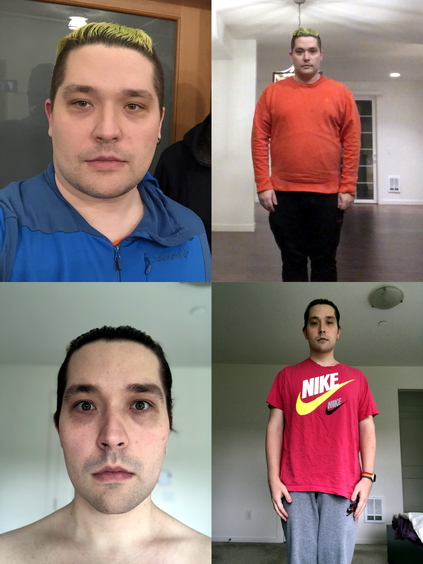

## Weight Loss Pt. 2

This is an update to my [previous post](../posts/2020-04-03.md), where I talk in detail how I lost 20 kilos (44 lbs) between November 17, 2019 and April 3, 2020.

Today, I'm celebrating shedding 10 additional kilos turning 20 into 30 (66 lbs), this took me almost two months. My current weight is right below 87 kilos (192 lbs). I'm not going to lie: the last ~5 kilos were quite tough, but it made me learn a lot about my body. Since the previous post, I started jogging a little bit (ran around 150 miles total in April and May), this works really well. I also tried to incorporate some strength training, but it only caused overeating, so I'm dumping it for now. Overall, life is good and I feel like a properly young person now!

Thanks to all the folks who support me along the way, I would not be able to do it without you. Special thanks to Oxana, who is particularly supportive while having to put up with my mood swings caused by dieting.

This is my "before vs after" picture:

This is the plot of my weight over time:

